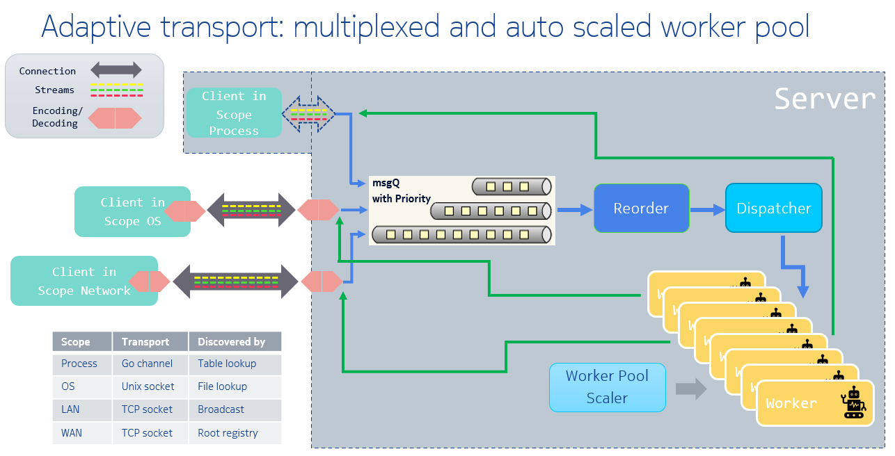

# Adaptiveservice

Adaptiveservice is a message oriented micro service framework.

[adaptiveservice go doc](https://pkg.go.dev/github.com/godevsig/adaptiveservice)

# Hello example

## Demo

```
$ cd examples/hello/

# start server, waiting requests from clients, ctrl+c to exit
$ go run server/helloserver.go

# start client in another terminal
# client discovers the server then sends request and prints the reply
$ go run client/helloclient.go
I am hello server, John
```

We can also start client before server to get the same result, client will wait in
discovering stage before server successfully started into service ready.

## Client side programing

The client imports the server's messages definitions:

```
import msg "github.com/godevsig/adaptiveservice/examples/hello/message"
```

Then we new a client which discovers the service identified by `{"example", "hello"}`
where "example" is the publisher of the service, "hello" is the name of the service.
When successfully discovered, a none-nil connection towards that service is established.

```
c := as.NewClient()

conn := <-c.Discover("example", "hello")
if conn == nil {
	fmt.Println(as.ErrServiceNotFound("example", "hello"))
	return
}
defer conn.Close()
```

Then we can use the connection to send our request `msg.HelloRequest`, asking
"I am John, who are you?" and wait for the reply `msg.HelloReply`,
then we print the `reply.Answer`.

```
request := msg.HelloRequest{Who: "John", Question: "who are you"}
var reply msg.HelloReply
if err := conn.SendRecv(request, &reply); err != nil {
	fmt.Println(err)
	return
}
fmt.Println(reply.Answer)
```

Here the client knows the protocol with the sersver that `msg.HelloReply` is the reply
type of `msg.HelloRequest`. The knowledge of message protocol is "business logic",
defined in server side, clients use such knowledge by importing the "message" package
of the serveer.

### Client discovers service by name

`c.Discover()` discovers the wanted named service in all available scopes, which are:

- Process scope: client and server run in same process.
  This scope uses go channel as transport layer, avoids data copy and serialization
  cost thus can improve performance significantly. See [gshellos](https://github.com/godevsig/gshellos)
  to make client and server run in process scope.
- OS scope: client and server run in same OS, which can be same host OS, or same VM, or same container.
  This scope uses unix socket as transport layer.
- LAN scope: client and server run in same LAN, using LAN broadcasting to discover services.
- WAN scope: This scope requires a "root registry" presents in one "public" node in the network
  that client and server can access. The root registry also setups proxy when necessary for the server
  if the server's network is invisible by the client.

By default the client will wait forever in discovering the wanted service,
[Client.SetDiscoverTimeout](https://pkg.go.dev/github.com/godevsig/adaptiveservice#Client.SetDiscoverTimeout)
can be used set a timeout to discover.

`c.Discover()` returns a channel from which user can get connections established to the server.
There could be many instances providing the same service in the network.

The connection can be multiplexed to get streams that provides independent context to transfer messages.
See also
[gshellos usage](https://github.com/godevsig/gshellos/blob/master/docs/adaptiveservice.md#client-side-multiplexed-connection)

## Server side programing

Server needs to define messages it can handle, and the messages it returns to clients as reply:

```
import as "github.com/godevsig/adaptiveservice"

// HelloRequest is the request from clients
type HelloRequest struct {
	Who      string
	Question string
}

// HelloReply is the reply of HelloRequest to clients
type HelloReply struct {
	Answer string
}

// Handle handles msg.
func (msg HelloRequest) Handle(stream as.ContextStream) (reply interface{}) {
	answer := "I don't know"

	question := strings.ToLower(msg.Question)
	switch {
	case strings.Contains(question, "who are you"):
		answer = "I am hello server"
	case strings.Contains(question, "how are you"):
		answer = "I am good"
	}
	return HelloReply{answer + ", " + msg.Who}
}

func init() {
	as.RegisterType(HelloRequest{})
	as.RegisterType(HelloReply{})
}
```

Here `HelloRequest` is a [known message](https://pkg.go.dev/github.com/godevsig/adaptiveservice#KnownMessage).
A known message has a `Handle` method, which defines how to process the msg sent by clients.
In the `init` function, the instances of known message and the reply message are registered to `Adaptiveservice`
type system which are used to route the incoming request message(`HelloRequest` here) to its handler.

- Incoming message are handled concurrently in a goroutine worker pool
- The reply returned by the handler will be delivered to the client if it is none-nil.
- The reply can also be an error, which will be delivered as err in `Recv(msgPtr) err` of client.
- `as.ContextStream` can be optionally used:
  - Each stream has its own [context](https://pkg.go.dev/github.com/godevsig/adaptiveservice#Context)
    which can be used to set/get context of the same stream.
  - Inside the message handler, the server can exchange messages with the client.
    See [subsequent message](https://github.com/godevsig/gshellos/blob/master/docs/adaptiveservice.md#subsequent-message)

### Server publishes service

The messages are defined in a package, server main package imports `examples/hello/message`.

```
import (
	"fmt"

	as "github.com/godevsig/adaptiveservice"
	msg "github.com/godevsig/adaptiveservice/examples/hello/message"
)

func main() {
	s := as.NewServer().SetPublisher("example")

	knownMsgs := []as.KnownMessage{msg.HelloRequest{}}
	if err := s.Publish("hello", knownMsgs); err != nil {
		fmt.Println(err)
		return
	}

	if err := s.Serve(); err != nil { // ctrl+c to exit
		fmt.Println(err)
	}
}
```

By calling `as.NewServer()` followed by `s.Publish`, the server registers the known messages to service
`{"example", "hello"}`, then server enters `Serve` to service the requests.

See also [publish a service](https://github.com/godevsig/gshellos/blob/master/docs/adaptiveservice.md#publish-a-service)

See also a more useful example that has multiplexed streams and implements PUB/SUB pattern:
[echo example](https://github.com/godevsig/adaptiveservice/tree/master/examples/echo)

## 3 API to transfer messages

Messages are server defined structs, or base types in golang. Unlike protobuf that users define .proto files
and compile them into langueage source code, `Adaptiveservice` uses plain go file: servers define them, client
imports them. We found in this way it is simpler to maintain the code, but of course it only supports native
golang.

- `Send(msg)` and `Recv(msgPtr)`: send or receive "one-way" data
- `SendRecv(msg, msgPtr)`: send and wait for reply from peer

See also [sned recv and sendrecv](https://github.com/godevsig/gshellos/blob/master/docs/adaptiveservice.md#send-recv-and-sendrecv)

# Block diagram



# Performance

In [gshellos](https://github.com/godevsig/gshellos) based [grepo](https://github.com/godevsig/grepo),
there is a [asbench test](https://github.com/godevsig/grepo/tree/master/benchmark/asbench) that mimics
a download test:

```
c := as.NewClient(as.WithLogger(lg), as.WithScope(Scope)).SetDiscoverTimeout(3)
conn := <-c.Discover(asbench.Publisher, asbench.Service)
if conn == nil {
	return as.ErrServiceNotFound(asbench.Publisher, asbench.Service)
}
defer conn.Close()

var running = true

dld := func() int64 {
	stream := conn.NewStream()
	req := asbench.DownloadRequest{Name: "testdld", ID: int32(1), Size: int32(*size)}
	//fmt.Println("request:", req)
	var rep []byte
	var counter int64
	for running {
		if err := stream.SendRecv(&req, &rep); err != nil {
			panic(err)
		}
		counter++
	}
	//fmt.Println("reply:", rep)
	return counter
}
```

The performance result is:

